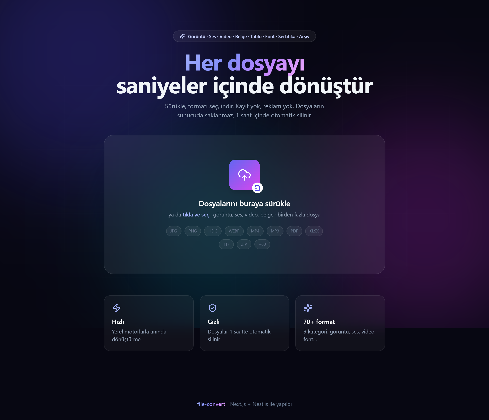
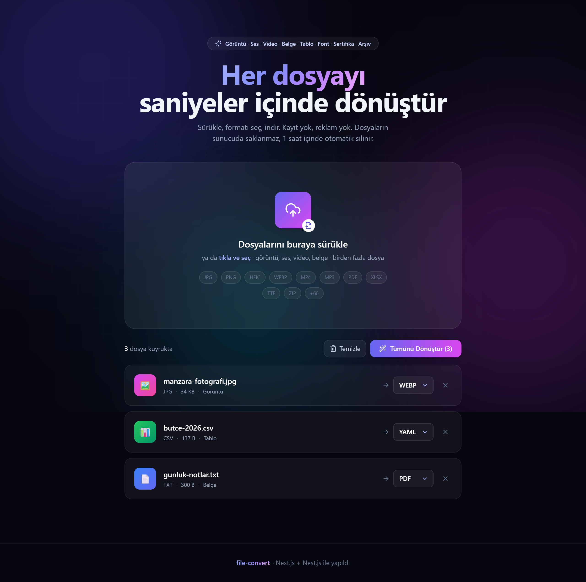
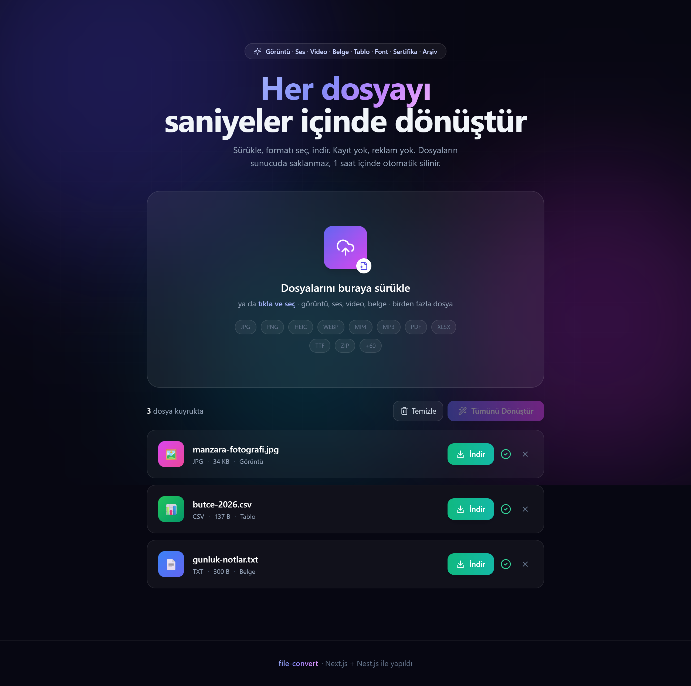
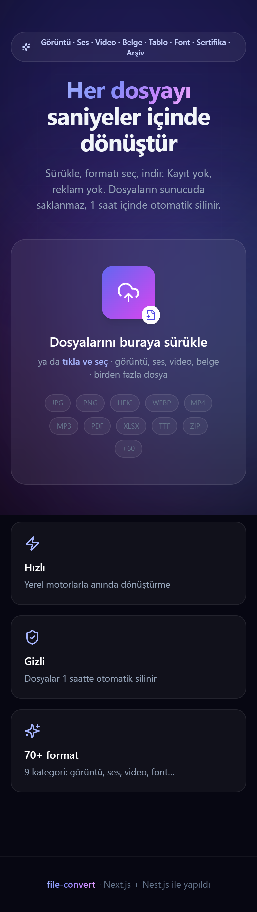
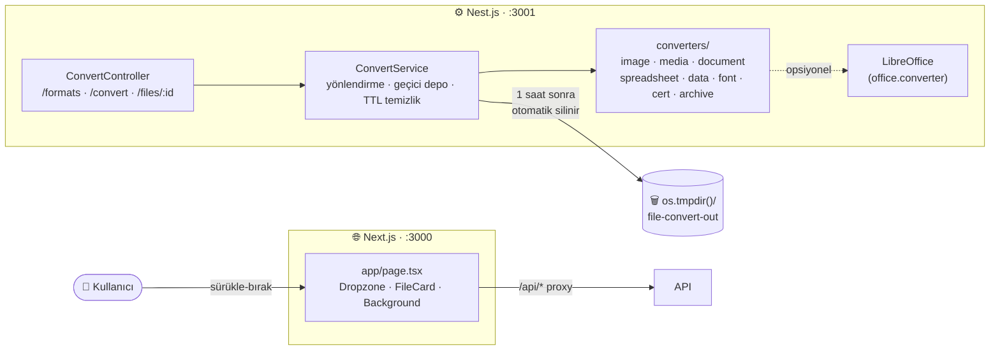

<div align="center">



# 🔄 file-convert

**Convertio benzeri, _yenilikçi_ ve _hızlı_ dosya & görüntü dönüştürme web uygulaması.**

Görüntü, ses, video ve belgeleri tarayıcıdan saniyeler içinde dönüştürün — kayıt yok, reklam yok, dosyalar 1 saatte otomatik silinir.

<br/>


</div>

---

## ✨ Öne çıkanlar

- 🚀 **70+ format, 9 kategori** — görüntü, ses, video, belge, tablo, veri, yazı tipi, sertifika, arşiv
- 🧩 **Sistem bağımlılığı yok** — tüm motorlar npm üzerinden gelir (`sharp` libheif dahil + `ffmpeg-static`); harici `convert`/`ffmpeg` kurmaya gerek yok
- 🔒 **Gizlilik öncelikli** — dosyalar diske kalıcı yazılmaz, geçici sonuç **1 saat** sonra otomatik silinir (TTL)
- ⚡ **Anlık ilerleme** — `XHR` upload ile gerçek yüzde, çoklu dosya, sürükle-bırak
- 🎨 **Modern arayüz** — glassmorphism + aurora arka plan, `framer-motion` animasyonları, tam responsive
- 🔁 **Çift yönlü dönüşüm** — Tablo ↔ Veri aileleri tam bağlanabilir (`csv→yaml`, `json→xlsx` …)
- 🧠 **Akıllı matris** — arayüz yalnızca o dosya için **gerçekten mümkün** olan hedefleri gösterir; desteklenmeyenleri "⚙ kurulum gerekiyor" olarak işaretler
- 📎 **LibreOffice opsiyonel** — kuruluysa `pdf↔docx`, `ppt/odt/rtf` ve tablo→pdf dönüşümleri otomatik açılır

---

## 📸 Ekran görüntüleri

<div align="center">

### 1 · Dosyaları seç ve hedef formatı belirle


<br/><br/>

### 2 · Dönüştür ve indir


<br/><br/>

### 📱 Mobil görünüm


</div>

> Sürükle → formatı seç → **Tümünü Dönüştür** → **İndir**. Her dosya kartında biçim, boyut, kategori, canlı ilerleme çubuğu ve durum rozeti görünür. _(Görseller uygulamanın gerçek çıktısından alınmıştır.)_

---

## 🗂️ Desteklenen dönüşümler

> 9 kategori, hepsi **npm motorlarıyla**, sistem aracı olmadan çalışır.

| Kategori | Motor | Girdi | Çıktı |
|---|---|---|---|
| 🖼️ **Görüntü** | sharp (libvips+libheif) + bmp-js + ico | jpg, png, webp, avif, gif, tiff, svg, **heic, heif**, bmp, ico | jpg, png, webp, avif, tiff, gif, bmp, ico, pdf |
| 🎵 **Ses** | ffmpeg-static | mp3, wav, ogg, m4a, aac, flac, opus, wma, amr, aiff, ac3, dts, alac | mp3, wav, ogg, m4a, aac, flac, opus, aiff, ac3, **wma, amr, dts** |
| 🎬 **Video** | ffmpeg-static | mp4, mov, webm, avi, mkv, flv, wmv, m4v, mpeg, 3gp, ts, mts, m2ts, ogv, asf, vob, f4v, rm, rmvb | mp4, webm, mov, avi, mkv, gif, mp3, wav, ts, mpg, m4v, 3gp, **flv, wmv, ogv** |
| 📄 **Belge** | mammoth, marked, pdfkit (+ LibreOffice) | docx, md, html, txt, **pdf** | html, txt, md, pdf, **docx** |
| 📊 **Tablo** | SheetJS | xlsx, xls, ods, csv, tsv | xlsx, **xls**, ods, csv, **tsv**, json, html, **yaml, xml, toml** |
| 🗂️ **Veri** | js-yaml, fast-xml-parser, toml, SheetJS | json, yaml, xml, toml | json, yaml, xml, toml, csv, **xlsx, html** |
| 🔤 **Yazı Tipi** | fonteditor-core, wawoff2 | ttf, woff, woff2, eot | ttf, woff, woff2, eot, svg |
| 🔐 **Sertifika** | node-forge | pem, der, cer, crt | pem, der, crt |
| 📦 **Arşiv** | adm-zip, tar, zlib | zip, tar, tgz, gz | zip, tar, tgz, **gz** |

**Notlar**
- **Çift yönlülük:** Tablo ↔ Veri aileleri tam bağlanabilir (örn. `csv→yaml`, `json→xlsx`). Ses/video'da yalnız-girdi olan biçimler (wma/amr/dts/flv/wmv/ogv) artık çıktı olarak da üretilir.
- **pdf ↔ word:** LibreOffice kuruluysa `pdf→docx/txt/md/html` ve `md/html/txt/pdf→docx` açılır (`docx→pdf` zaten çalışır).
- **Tek yönlü kalanlar:** svg/heic/heif kodlama ve pdf→görüntü npm motoruyla üretilemez.

<details>
<summary><b>⚙ Henüz desteklenmeyenler</b> (sistem aracı gerektirir — arayüzde "kurulum gerekiyor" olarak gösterilir)</summary>

<br/>

- **Kamera RAW** (cr2/nef/arw/dng…) → `libraw`
- **AI / EPS** → `ghostscript`
- **PDF → görüntü** → `poppler`
- **epub / mobi / azw3** → `calibre`
- **pfx / p12** → şifre girişi gerekir
- **apk / ipa / ROM / 3D-CAD** → platformlar arası dönüştürülemez
- **doc / ppt / pptx / odt / odp / rtf** ve **pdf girişi** → LibreOffice kuruluysa otomatik etkinleşir

</details>

---

## 🚀 Hızlı başlangıç

```bash
# 1) Bağımlılıkları kur (sharp ve ffmpeg ikili dosyalarını indirir)
npm install

# 2) Geliştirme — API (3001) + Web (3000) birlikte çalışır
npm run dev
```

Tarayıcıda **http://localhost:3000** adresini açın.

```bash
# Yalnızca backend
npm run dev:api

# Yalnızca frontend
npm run dev:web

# Üretim derlemesi
npm run build && npm start
```

> **İsteğe bağlı:** Office formatları (doc/ppt/odt/pdf↔word) için sisteme **LibreOffice** kurun. Kuruluysa ek dönüşümler otomatik açılır; kurulu değilken uygulama npm motorlarıyla sorunsuz çalışmaya devam eder.

---

## 🏗️ Mimari

Frontend her zaman **same-origin** `/api` çağırır; Next.js bunu Nest API'ye proxy'ler (`next.config.js` → `rewrites`). Böylece CORS derdi olmadan tek origin üzerinden çalışır.



**Akış:** `Dropzone` dosyaları kuyruğa alır → uzantıya göre `/api/formats` matrisinden hedefler belirlenir → `ConvertController` `multipart/form-data` ile dosyayı alır → `ConvertService` kategoriye göre ilgili `converter`'a yönlendirir → sonuç geçici klasöre yazılır, `id` döner → kullanıcı `/api/files/:id` ile indirir → kayıt **1 saat** sonra TTL ile temizlenir.

---

## 🔌 API

| Yöntem | Yol                          | Açıklama                                       |
|--------|------------------------------|------------------------------------------------|
| `GET`  | `/api/formats`               | Desteklenen dönüşüm matrisi (gruplar + lookup) |
| `POST` | `/api/convert?target=png`    | `multipart/form-data` `file` → dönüştür        |
| `GET`  | `/api/files/:id`             | Dönüştürülmüş dosyayı indir (`?inline=1` ön izleme) |
| `GET`  | `/api/health`                | Sağlık kontrolü                                |

**Örnek**

```bash
# HEIC fotoğrafı WebP'ye dönüştür
curl -F "file=@tatil.heic" "http://localhost:3001/api/convert?target=webp"
# → { "id": "…", "filename": "tatil.webp", "size": 84213, "mime": "image/webp" }

curl -OJ "http://localhost:3001/api/files/<id>"
```

> Maksimum dosya boyutu: **200 MB** (`convert.controller.ts`).

---

## 📁 Proje yapısı

```
file-convert/
├── apps/
│   ├── api/                          # Nest.js dönüştürme servisi (:3001)
│   │   └── src/convert/
│   │       ├── formats.ts            # Format kayıt matrisi (registry) + normalize
│   │       ├── convert.controller.ts # /api/formats · /api/convert · /api/files/:id
│   │       ├── convert.service.ts    # Yönlendirme + geçici depolama + TTL temizlik
│   │       ├── libreoffice.ts        # soffice algılama (opsiyonel Office desteği)
│   │       └── converters/           # image · media · document · spreadsheet · data
│   │                                 #  · font · cert · archive · office · _shared
│   └── web/                          # Next.js arayüz (:3000)
│       ├── app/page.tsx              # Ana ekran (durum yönetimi)
│       ├── app/layout.tsx            # Metadata + global stiller
│       ├── components/               # Dropzone · FileCard · Background
│       └── lib/                      # API istemcisi · tipler · yardımcılar
├── docs/                             # README ekran görüntüleri (PNG)
└── package.json                      # npm workspaces + concurrently
```

---

## ➕ Yeni format eklemek

1. `apps/api/src/convert/formats.ts` içindeki ilgili gruba uzantıyı (`inputs`/`outputs`) ekleyin.
2. `converters/` altındaki ilgili motorda `switch` dalını genişletin.
3. Hepsi bu kadar — frontend matrisi `/api/formats` üzerinden **otomatik** alır, ekstra UI kodu gerekmez.

Format ailelerini birbirine bağlamak (örn. tablo→veri) için seri hale getiriciyi diğer kategorinin converter'ına devredebilirsiniz; `spreadsheet.converter.ts` ↔ `data.converter.ts` bunun örneğidir.

---

<div align="center">

**file-convert** · ☕ + Next.js & Nest.js ile yapıldı

</div>
